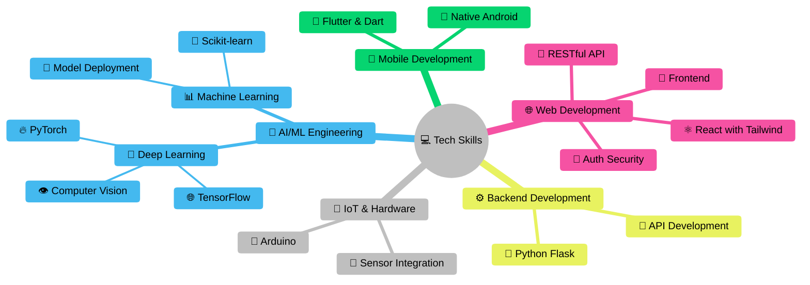

  

 

<h1 align="center">

</h1>

<h3 align="center">Computer Science & Engineering student focused on building innovative tech solutions.</h3>

<h3 align="center">🎨 𝘿𝙚𝙨𝙞𝙜𝙣𝙚𝙧 by heart 👨‍💻 𝘿𝙚𝙫𝙚𝙡𝙤𝙥𝙚𝙧 by work</h3>

 

  
  
  
  <!--  -->

---

<h3 align="left">👨🏻‍💻 𝗔𝗯𝗼𝘂𝘁 𝗠𝗲</h3>

🔭 I'm currently working on Vrinda, an AI-powered app for enhanced crop production.  🌱 I'm currently learning Deep Learning and Web Development.  👯 I'm looking to collaborate on AI/ML and flutter projects.  🏆 Achievements: SIH'24 Winner and 6x Hackathon Winner.  🤔 I'm looking for help with open-source contributions.  💬 Ask me about AI, Winning SIH and hackathons, or impactful projects.  📫 How to reach me: <a href="mailto:prabhjotassi16@gmail.com">prabhjotassi16@gmail.com</a>  😄 Pronouns: He/Him  ⚡ Fun fact: What did the spider do on the computer? Made a website!🕷️💻

---

## 🧠 **Core Competencies**

```mermaid
%%{init: {
  'theme': 'base',
  'themeVariables': {
    'primaryColor': '#ffffffff',
    'primaryTextColor': '#000000ff',
    'primaryBorderColor': '#1d4ed8',
    'lineColor': '#597fb4ff',
    'secondaryColor': '#0e12e9ff',
    'tertiaryColor': '#06b6d4',
    'background': '#596d9cff',
    'mainBkg': '#1e293b',
    'secondBkg': '#4f71a1ff',
    'tertiaryBkg': '#42597aff',
    'cScale0': '#2563eb',
    'cScale1': '#44b9efff',
    'cScale2': '#06d470ff',
    'cScale3': '#e8f260ff',
    'cScale4': '#f552a3ff'
  }
}}%%

mindmap
  root((💻 Tech Skills))
    🤖 AI/ML Engineering
      🧠 Deep Learning
        🔥 PyTorch
        🌐 TensorFlow
        👁️ Computer Vision
      📊 Machine Learning
        🔬 Scikit-learn
        🚀 Model Deployment
    📱 Mobile Development
      🎨 Flutter & Dart
      🤖 Native Android
    ⚙️ Backend Development
      🐍 Python Flask
      🔌 API Development
    🌐 Web Development
      ⚛️ React with Tailwind
      🎨 Frontend
      🔐 Auth Security
      🔌 RESTful API
    🔧 IoT & Hardware
      🤖 Arduino
      📡 Sensor Integration
```

---

## 🚀 Tech Stack

---

## ⚡ GitHub Stats

<!--  -->

--- 

## 🐍 My Contributions

<picture>
  <source media="(prefers-color-scheme: dark)" srcset="https://raw.githubusercontent.com/prabhjot0109/prabhjot0109/output/github-snake-dark.svg" />
  <source media="(prefers-color-scheme: light)" srcset="https://raw.githubusercontent.com/prabhjot0109/prabhjot0109/output/github-snake.svg" />
  
</picture>

 

  Thank you for visiting! 😊 Feel free to connect.🌐 

