<!--
**prabhjot0109/prabhjot0109** is a ✨ _special_ ✨ repository because its `README.md` (this file) appears on your GitHub profile.
-->

  

<h1 align="center">

</h1>

<h2 align="center">Computer Science & Engineering student and passionate software developer, focused on creating innovative tech solutions.</h2>

<h3 align="center">👨‍💻 𝘿𝙚𝙫𝙚𝙡𝙤𝙥𝙚𝙧 by work, 🎨 𝘿𝙚𝙨𝙞𝙜𝙣𝙚𝙧 by heart.</h3>

<h3 align="left">👨🏻‍💻 𝗔𝗯𝗼𝘂𝘁 𝗠𝗲:</h3>

🔭 I'm currently working on Med.ai, an AI-powered healthcare webapp.  🌱 I'm currently learning Web Development.  👯 I'm looking to collaborate on AI/ML and flutter projects.  🆠Achievements: SIH'24 Winner and 5x Hackathon Winner.  🤔 I'm looking for help with open-source contributions.  💬 Ask me about AI, Winning SIH and hackathons, or impactful projects.  📫 How to reach me: <a href="mailto:prabhjotassi16@gmail.com">prabhjotassi16@gmail.com</a>  😄 Pronouns: He/Him  ⚡ Fun fact: What did the spider do on the computer? Made a website!🕷ï¸ğŸ’»

---

## 🌐 Connect & Collaborate

  
  
  <!--  -->

---

## 🧠 **Core Competencies**

```mermaid
%%{init: {
  'theme': 'base',
  'themeVariables': {
    'primaryColor': '#ffffffff',
    'primaryTextColor': '#000000ff',
    'primaryBorderColor': '#1d4ed8',
    'lineColor': '#64748b',
    'secondaryColor': '#0ea5e9',
    'tertiaryColor': '#06b6d4',
    'background': '#0f172a',
    'mainBkg': '#1e293b',
    'secondBkg': '#334155',
    'tertiaryBkg': '#475569',
    'cScale0': '#2563eb',
    'cScale1': '#0ea5e9',
    'cScale2': '#06b6d4',
    'cScale3': '#8b5cf6',
    'cScale4': '#ec4899'
  }
}}%%

mindmap
  root((💻 Tech Skills))
    🤖 AI/ML Engineering
      🧠 Deep Learning
        🔥 PyTorch
        🌐 TensorFlow
        👁️ Computer Vision
      📊 Machine Learning
        🔬 Scikit-learn
        🚀 Model Deployment
    📱 Mobile Development
      🎨 Flutter & Dart
      🤖 Native Android
    ⚙️ Backend Development
      🐍 Python Flask
      🔌 API Development
    🔧 IoT & Hardware
      🤖 Arduino
      📡 Sensor Integration
```

---

## 🚀 Tech Stack

---

## ⚡ GitHub Stats

---

## 🏆 GitHub Trophies

---

<!-- ## 📈 Contribution Graph

--- -->

## 🐍 My Contributions

<picture>
  <source media="(prefers-color-scheme: dark)" srcset="https://raw.githubusercontent.com/prabhjot0109/prabhjot0109/output/github-snake-dark.svg" />
  <source media="(prefers-color-scheme: light)" srcset="https://raw.githubusercontent.com/prabhjot0109/prabhjot0109/output/github-snake.svg" />
  
</picture>

 

  Thank you for visiting! 😊 Feel free to connect.🌠
  ⭐ Follow me on GitHub if you found it interesting! ⭐
  

