<!--
**prabhjot0109/prabhjot0109** is a ✨ _special_ ✨ repository because its `README.md` (this file) appears on your GitHub profile.

Here are some ideas to get you started:

- 🔭 I’m currently working on ...
- 🌱 I’m currently learning ...
- 👯 I’m looking to collaborate on ...
- 🤔 I’m looking for help with ...
- 💬 Ask me about ...
- 📫 How to reach me: ...
- 😄 Pronouns: ...
- ⚡ Fun fact: ...
-->

  

<h1 align="left">

</h1>

<h3 align="left">A computer science & engineering student and passionate software developer from India, focused on creating innovative tech solutions.</h3>

<h3 align="center">👨‍💻 𝘿𝙚𝙫𝙚𝙡𝙤𝙥𝙚𝙧 by work, 🎨 𝘿𝙚𝙨𝙞𝙜𝙣𝙚𝙧 by heart.</h3>

<h3 align="left">👨🏻‍💻 𝗔𝗯𝗼𝘂𝘁 𝗠𝗲:</h3>

🔭 I’m currently working on Med.ai, an AI-powered healthcare system.  🌱 I’m currently learning Advanced Python, Machine Learning, and Flutter.  👯 I’m looking to collaborate on AI/ML and flutter projects.  🆠Achievements: SIH'24 Winner and HackWave Hackathon Winner.  🤔 I’m looking for help with open-source contributions.  💬 Ask me about AI, Winning SIH and hackathons, or impactful projects.  📫 How to reach me: <a href="mailto:prabhjotassi16@gmail.com">prabhjotassi16@gmail.com</a>  😄 Pronouns: He/Him  ⚡ Fun fact: What did the spider do on the computer? Made a website!🕷ï¸ğŸ’»

---

## 🌐 Connect & Collaborate

  
  
  
  <!--  -->

---

## 🏆 Major Achievements & Recognition

<table>
  <tr>
    <th>🏅 <strong>Achievement</strong></th>
    <th>🏛️ <strong>Organization</strong></th>
    <th>📅 <strong>Year</strong></th>
    <th>💻 <strong>Product</strong></th>
  </tr>
  <tr>
    <td>🥇 <strong>SIH 2024 Winner</strong></td>
    <td>MoE's IC & AICTE</td>
    <td>2024</td>
    <td>AI App</td>
  </tr>
  <tr>
    <td>💰 <strong>IEEE Tech4Good Grant</strong></td>
    <td>IEEE HTB</td>
    <td>2024</td>
    <td>AI App</td>
  </tr>
  <tr>
    <td>🏆 <strong>HackWave Winner</strong></td>
    <td>CDGI, Indore</td>
    <td>2024</td>
    <td>Ml Model</td>
  </tr>
  <tr>
    <td>🥉 <strong>Prayatna 3rd Runner-up</strong></td>
    <td>AITR, Indore</td>
    <td>2024</td>
    <td>AI Webapp</td>
  </tr>
  <tr>
    <td>🥈 <strong>Codespire Runner-up</strong></td>
    <td>AITR, Indore</td>
    <td>2023</td>
    <td>Software</td>
  </tr>
</table>

---

## 💼 Featured Projects Portfolio

### 🔥 **Signify** - _AI Sign Language Translator_

> 🏆 **SIH 2024 Winner** | **Problem Statement 1716**

  
  
  
  

**Revolutionary AI-driven Indian Sign Language translation system** that bridges communication gaps for the hearing-impaired community.

- ✨ **Real-time gesture recognition** of 40+ ISL gestures
- 🎯 **Multi-modal output:** Text and speech conversion
- 📱 **Cross-platform** Flutter application
- 🔬 **MediaPipe integration** for precise hand tracking
- 🏆 **National recognition** as SIH 2024 winning solution

---

### 🏥 **Med.AI** - _Healthcare Intelligence System_

> 🥉 **Prayatna Hackathon 3rd Runner-up**

  
  
  
  

**AI-powered medical diagnostic assistant** that enhances healthcare decision-making through advanced analytics.

- 🔍 **Intelligent symptom analysis** with data-driven insights
- 📊 **X-Ray image recognition** with 15% accuracy improvement
- ⚕️ **Medical expert assistance** for diagnostic support
- 🧠 **Deep learning models** for pattern recognition
- 💡 **Scalable architecture** for clinical deployment

---

### 🌾 **Krishi** - _Smart Agriculture Platform_

> 💰 **$4000 IEEE Tech4Good Grant Recipient**

  
  
  
  

**IoT-enabled agricultural intelligence system** empowering farmers with data-driven crop management.

- 📊 **Real-time soil analysis** with IoT sensor integration
- 🌦️ **Weather-based recommendations** via OpenWeather API
- 🤖 **AI-powered insights** using Gemini API
- 📈 **20% crop yield improvement** in field trials
- 👨‍🌾 **10+ farmers impacted** in Indore region

---

### 🚨 **Kavach** - _Emergency SOS System_

> 🛡️ **Safety Innovation Project**

  
  
  
  

**Intelligent emergency response application** with advanced speech recognition capabilities.

- 🎤 **Voice-activated SOS** with predefined trigger words
- 🔒 **Locked-screen functionality** for emergency access
- 🌟 **80% accuracy** in noisy environments
- 🚀 **Non-suspicious activation** for user safety
- 📱 **Native Android** implementation

---

### 🧠 **Core Competencies**

```mermaid
mindmap
  root((💻 Tech Skills))
    🤖 AI/ML Engineering
      🧠 Deep Learning
        🔥 PyTorch
        🌐 TensorFlow
        👁️ Computer Vision
      📊 Machine Learning
        🔬 Scikit-learn
        🚀 Model Deployment
    📱 Mobile Development
      🎨 Flutter & Dart
      🤖 Native Android
    ⚙️ Backend Development
      🐍 Python Flask
      🔌 API Development
    🔧 IoT & Hardware
      🤖 Arduino
      📡 Sensor Integration
```

---

## 🚀 Tech Stack

---

## 📜 **Professional Certifications**

  
  
  

---

## 💡 Innovation & Research

  
  
  

---

## 💼 Professional Experience

### 🏢 **Intern**

**Edunet Foundation** | _November 2024 - December 2024_

  
  
  

**Key Achievements:**

- 🚀 **Deployed production-ready ML model** for image classification using CNN architecture
- 📊 **Utilized MobileNetV2** pre-trained on ImageNet for transfer learning
- ☁️ **Cloud deployment** on Streamlit platform with real-time inference
- 📈 **Improved model efficiency** through optimization techniques

---

## ⚡ GitHub Stats

---

## 🏆 GitHub Trophies

---

## 📈 Contribution Graph

---

## 🐍 My Contributions

<picture>
  <source media="(prefers-color-scheme: dark)" srcset="https://raw.githubusercontent.com/prabhjot0109/prabhjot0109/output/github-snake-dark.svg" />
  <source media="(prefers-color-scheme: light)" srcset="https://raw.githubusercontent.com/prabhjot0109/prabhjot0109/output/github-snake.svg" />
  
</picture>

 

  Thank you for visiting! 😊 Feel free to connect.🌠
    ⭐ Star this repository if you found it interesting! ⭐
  

