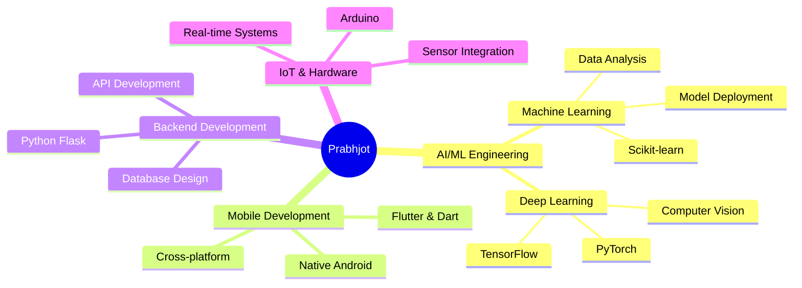

<!--
**prabhjot0109/prabhjot0109** is a ✨ _special_ ✨ repository because its `README.md` (this file) appears on your GitHub profile.
-->

  

<h1 align="center">

</h1>

<h3 align="center">🎓 AI & ML Engineering Student | 🚀 Product Developer | 🏆 Hackathon Champion</h3>
<h3 align="center">Building innovative tech solutions that create real-world impact 🌍</h3>

  
  
  

---

## 🚀 About Me

🎯 **Innovative AI/ML Engineer** passionate about transforming ideas into impactful solutions

🏆 **Smart India Hackathon 2024 Winner** with $4000 IEEE Tech4Good grant recipient

🌱 **Currently mastering:** Advanced Deep Learning, Computer Vision, and Flutter Development

🔬 **Research Focus:** AI in Healthcare, Sign Language Processing, and Agricultural Technology

💡 **Mission:** Creating accessible technology that bridges communication gaps and enhances lives

📫 **Reach me:** [prabhjotassi16@gmail.com](mailto:prabhjotassi16@gmail.com)

⚡ **Fun fact:** "Code is poetry written in logic - and I'm fluent in both languages!" 🎨💻

---

## 🏆 Major Achievements & Recognition

  
| 🏅 **Achievement** | 🏛️ **Organization** | 📅 **Year** | 💰 **Value** |
|-------------------|---------------------|-------------|---------------|
| 🥇 **SIH 2024 Winner** | MoE's IC & AICTE | 2024 | ₹1,00,000 Prize |
| 💰 **IEEE Tech4Good Grant** | IEEE HTB | 2024 | $4,000 USD |
| 🏆 **HackWave Winner** | Chameli Devi Group | 2024 | 1st Place |
| 🥉 **Prayatna 3rd Runner-up** | AITR Indore | 2024 | Healthcare AI |
| 🥈 **Codespire Runner-up** | AITR Indore | 2023 | Audio Analysis |

  
  
  

---

## 💼 Featured Projects Portfolio

### 🔥 **Signify** - *AI Sign Language Translator*
> 🏆 **SIH 2024 Winner** | **Problem Statement 1716**

  
  
  
  

**Revolutionary AI-driven Indian Sign Language translation system** that bridges communication gaps for the hearing-impaired community.

- ✨ **Real-time gesture recognition** of 40+ ISL gestures
- 🎯 **Multi-modal output:** Text and speech conversion
- 📱 **Cross-platform** Flutter application
- 🔬 **MediaPipe integration** for precise hand tracking
- 🏆 **National recognition** as SIH 2024 winning solution

---

### 🏥 **Med.AI** - *Healthcare Intelligence System*
> 🥉 **Prayatna Hackathon 3rd Runner-up**

  
  
  
  

**AI-powered medical diagnostic assistant** that enhances healthcare decision-making through advanced analytics.

- 🔍 **Intelligent symptom analysis** with data-driven insights
- 📊 **X-Ray image recognition** with 15% accuracy improvement
- ⚕️ **Medical expert assistance** for diagnostic support
- 🧠 **Deep learning models** for pattern recognition
- 💡 **Scalable architecture** for clinical deployment

---

### 🌾 **Krishi** - *Smart Agriculture Platform*
> 💰 **$4000 IEEE Tech4Good Grant Recipient**

  
  
  
  

**IoT-enabled agricultural intelligence system** empowering farmers with data-driven crop management.

- 📊 **Real-time soil analysis** with IoT sensor integration
- 🌦️ **Weather-based recommendations** via OpenWeather API
- 🤖 **AI-powered insights** using Gemini API
- 📈 **20% crop yield improvement** in field trials
- 👨‍🌾 **10+ farmers impacted** in Indore region

---

### 🚨 **Kavach** - *Emergency SOS System*
> 🛡️ **Safety Innovation Project**

  
  
  
  

**Intelligent emergency response application** with advanced speech recognition capabilities.

- 🎤 **Voice-activated SOS** with predefined trigger words
- 🔒 **Locked-screen functionality** for emergency access
- 🌟 **80% accuracy** in noisy environments
- 🚀 **Non-suspicious activation** for user safety
- 📱 **Native Android** implementation

---

## 🎯 Technology Mastery & Skills

### 🧠 **Core Competencies**

### 💻 **Technical Arsenal**

<table align="center">
<tr>
<td align="center" width="25%">

  

</td>
<td align="center" width="25%">

  

</td>
<td align="center" width="25%">

  

</td>
<td align="center" width="25%">

  

</td>
</tr>
</table>

### 🎯 **Skill Progression Matrix**

| **Domain** | **Proficiency** | **Experience** | **Key Projects** |
|------------|-----------------|----------------|------------------|
| 🧠 **AI/ML Development** | ████████████████████ 95% | 2+ Years | Signify, Med.AI, Krishi |
| 📱 **Mobile Development** | ████████████████░░░░ 85% | 1.5+ Years | Signify, Krishi, Kavach |
| 🔬 **Computer Vision** | ██████████████░░░░░░ 75% | 1+ Year | Signify, Med.AI |
| ⚡ **Backend Systems** | ████████████░░░░░░░░ 65% | 1+ Year | Med.AI, API Development |
| 🔧 **DevOps & Deployment** | ██████████░░░░░░░░░░ 55% | 6+ Months | Streamlit, Cloud Deploy |

---

## 🎓 Education & Professional Development

### 🏛️ **Academic Background**

<table>
<tr>
<td align="center" width="50%">

  
<strong>Acropolis Institute of Technology and Research</strong> 
<em>Indore, Madhya Pradesh</em> 
<strong>CGPA:</strong> 7.17/10 | <strong>Duration:</strong> Oct 2022 - July 2026  
<strong>Core Coursework:</strong> 
Data Structures & Algorithms, Machine Learning, Deep Learning, 
Computer Networks, Database Management, Cloud Computing
</td>
<td align="center" width="50%">

  
<strong>Chameli Devi Public School</strong> 
<em>Indore, Madhya Pradesh</em> 
<strong>12th CBSE:</strong> 73% | <strong>10th CBSE:</strong> 90.4% 
<strong>Duration:</strong> April 2019 - July 2022  
<strong>Achievements:</strong> 
Science Stream Excellence, Mathematics Proficiency, 
Academic Consistency
</td>
</tr>
</table>

### 📜 **Professional Certifications**

  
  
  

---

## 💼 Professional Experience

### 🏢 **AI Research Intern**
**Edunet Foundation** | *November 2024 - December 2024*

  
  
  

**Key Achievements:**
- 🚀 **Deployed production-ready ML model** for image classification using CNN architecture
- 📊 **Utilized MobileNetV2** pre-trained on ImageNet for transfer learning
- ☁️ **Cloud deployment** on Streamlit platform with real-time inference
- 📈 **Improved model efficiency** through optimization techniques

---

## 🌟 Leadership & Extracurricular Excellence

### 👨‍💼 **Leadership Roles**

<table>
<tr>
<td align="center" width="50%">

  
<strong>IEEE Student Branch - AITR</strong> 
<em>Webmaster & Lead Developer</em>  
• Led web development initiatives 
• Managed IEEE SIGHT affinity group projects 
• Developed IEEE HTB funded application 
• Coordinated technical workshops
</td>
<td align="center" width="50%">

  
<strong>CSE (AIML) Department</strong> 
<em>Magazine Design Lead</em>  
• Designed "L.E.A.R.N." department magazine 
• Created visual identity and branding 
• Managed creative team coordination 
• Enhanced department communication
</td>
</tr>
</table>

### 🎯 **Core Values & Soft Skills**

  
  
  
  
  

---

## 🌐 Connect & Collaborate

### 📬 **Let's Build Something Amazing Together!**

  
  
  
  

### 🚀 **Currently Open For:**

<table align="center">
<tr>
<td align="center" width="25%">
💼 <strong>Full-time Opportunities</strong> 
AI/ML Engineer, Product Developer
</td>
<td align="center" width="25%">
🤝 <strong>Open Source Collaboration</strong> 
Contributing to impactful projects
</td>
<td align="center" width="25%">
💡 <strong>Research Partnerships</strong> 
AI in Healthcare, Accessibility Tech
</td>
<td align="center" width="25%">
🚀 <strong>Startup Ventures</strong> 
Building innovative solutions
</td>
</tr>
</table>

**"Innovation thrives at the intersection of technology and human needs. Let's create solutions that matter!"** 🌟

---

## 📊 GitHub Analytics & Performance

### 📈 **Development Activity Overview**

<table>
<tr>
<td>

</td>
<td>

</td>
</tr>
</table>

### 💻 **Technology Distribution & Productivity**

<table>
<tr>
<td>

</td>
<td>

</td>
</tr>
</table>

### 🏆 **Achievement Showcase**

### 📈 **Contribution Visualization**

### 🐍 **Contribution Snake Animation**

<picture>
  <source media="(prefers-color-scheme: dark)" srcset="https://raw.githubusercontent.com/prabhjot0109/prabhjot0109/output/github-snake-dark.svg" />
  <source media="(prefers-color-scheme: light)" srcset="https://raw.githubusercontent.com/prabhjot0109/prabhjot0109/output/github-snake.svg" />
  
</picture>

---

  
  
  **"Code with purpose, innovate with passion, and always strive to make a difference."** 💫
  
  ⭐ **Star this repository if you found it interesting!** ⭐
  
  

